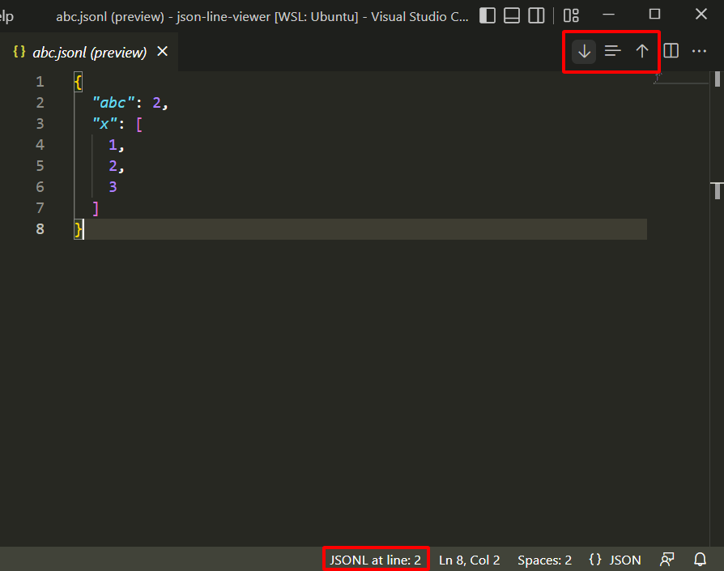

# JSON Lines Viewer

This extension provides previews for JSON Lines (JSONL) files.
It show content of JSONL file's lines in JSON format.

## Features

**View JSON Lines:**

To open the preview for a specific line, do one of the following:
- Right-click a `.jsonl` file in the explorer, choose `Open JSON Lines Preview`. This will open the line currently selected or the first line.
- Open a `.jsonl` file, place your cursor on the desired line, and run the command `JSONL: Open JSON Lines Preview` from the command palette (Cmd/Ctrl+Shift+P).
- Open a `.jsonl` file, place your cursor on the desired line, and click the `Open JSON Lines Preview` icon (`$(json)`) in the editor title bar.

**Edit JSON Lines:**

- Opening the preview now creates a **temporary, editable `.json` file** containing the formatted content of the selected line.
- You can modify the content directly in this temporary file.
- **Save** the temporary file (Cmd+S / Ctrl+S). The extension will:
    - Validate if the content is valid JSON.
    - Format the JSON back into a single line.
    - Write the single-line JSON back to the original `.jsonl` file at the correct line number.

**Navigate Between Lines (in Edit View):**

- When viewing the temporary edit file, navigation buttons appear in the editor title bar:
    - `JSONL Previous Line` (`$(arrow-up)`)
    - `JSONL Next Line` (`$(arrow-down)`)
    - `JSONL Go to Line` (`$(selection)`)
- Clicking these buttons (or running the corresponding commands) will close the current temporary file and open a new one for the target line.

**Automatic Cleanup:**

- Temporary edit files are automatically deleted when their editor tab is closed.
- The temporary directory is cleaned up on VS Code startup/reload to remove any orphaned files from previous sessions.

<!-- ## Requirements -->

<!-- ## Extension Settings -->

<!-- This extension contributes the following settings:

* `myExtension.enable`: enable/disable this extension
* `myExtension.thing`: set to `blah` to do something -->

<!-- ## Known Issues -->

## Release Notes

### 0.1.0 (2025-04-20)
- **Added Line Editing**: You can now edit individual lines via a temporary JSON file. Saving the temp file updates the original `.jsonl` file.
- **Added Automatic Cleanup**: Temporary files are cleaned up when closed or on startup.
- **Added Contextual Navigation**: Previous/Next/Go To Line buttons now only appear in the edit view.
- **Fixed Multi-Window Safety**: Startup cleanup no longer interferes with other VS Code windows.

### 0.0.4
- Fix path error in Linux

### 0.0.3
- Fix path error in Windows

### 0.0.2
- Update Readme and instructions

### 0.0.1
Initial release